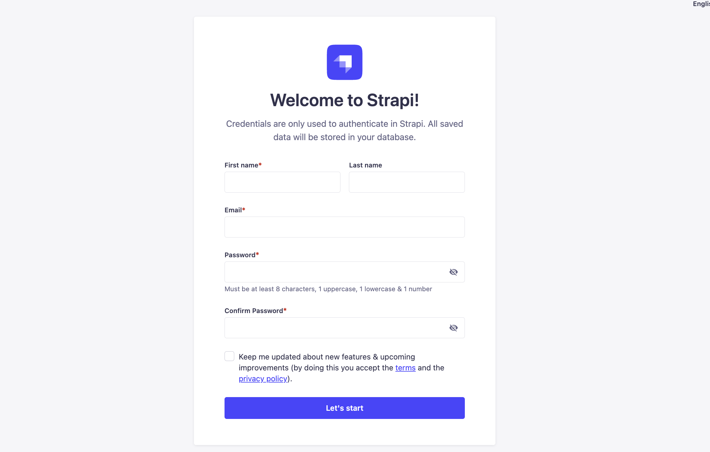
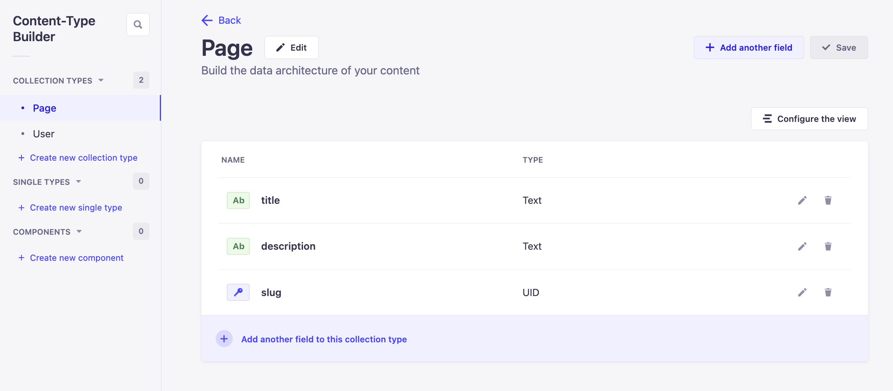

# Strapi 101 Next JS 13 and Strapi Intro

- Basic Next JS Project Setup
- Basic Strapi JS Project Setup
- Putting it all together

## Basic Next JS Project Setup

Next JS reference docs [here](https://nextjs.org/docs/getting-started/installation)

Let's run the command below to setup our Next JS application.

```bash
  npx create-next-app@latest
```

```bash
Need to install the following packages:
  create-next-app@13.4.8
Ok to proceed? (y) y
✔ What is your project named? … client
✔ Would you like to use TypeScript? … No / Yes
✔ Would you like to use ESLint? … No / Yes
✔ Would you like to use Tailwind CSS? … No / Yes
✔ Would you like to use `src/` directory? … No / Yes
✔ Would you like to use App Router? (recommended) … No / Yes
✔ Would you like to customize the default import alias? … No / Yes
Creating a new Next.js app in /Users/paulbratslavsky/programming/intro-strapi/client.

```

Here are our setting we are going to use.

You can run the following commands to start your next js application.

```bash
  cd client
  yarn dev
```

We should now see your Next JS app.


## Basic Strapi JS Project Setup

Let's now set up our Strapi application.

Strapi JS reference docs [here](https://docs.strapi.io/dev-docs/quick-start)

Let's run the command below to setup our Strapi JS application.

```bash
  npx create-strapi-app@latest server --quickstart
```

Your Strapi Application should start automatically.

If not, you can start it by the following code.

```bash
  cd server
  yarn develop
```

Once your Strapi application starts, go ahead and create your first **admin** user.



Now that we have created a user, lets creates a new _collection-type_ and connect our next JS app and Strapi.

Collection Name: Page

- title: short text
- description: long text
- slug: uid



Now that we have our first collection type, let's add our first page and see if we can get the data via Insomnia.


For time being let's give public access permission so we can query out data.


After saving the permissions we can now query our data via **Postman** or **Insomnia**

I am going to use **Insomnia**.

Here is our first request to get all pages.


But now lets update our query params to find our page via the slug. Since in the future we can have multiple pages.

In Strapi we use LHS syntax with can be a bit difficult to write your self, and recommend that you use the **qs** library to make your life easier.

But luckily Strapi has a tool that makes this a bit easier. You can find it [here](https://docs.strapi.io/dev-docs/api/rest/interactive-query-builder).

Here is our full query using the LHS syntax to get page by slug `http://localhost:1337/api/pages?filters[slug]=home`.

Let's give this a try.


Great, we are able to get our page. Now lets hook ups our Next JS frontend with our Strapi backend.

## Putting it all together

Let's get our data from our server and show it int the client.

First, in our Next js project lets update our folder.

Inside the `client/src/app/page.tsx` lets delete everything between the `<main>` tags. We should be left with the following code.

```tsx
export default function Home() {
  return (
    <main className="flex min-h-screen flex-col items-center justify-between p-24"></main>
  );
}
```

Now lets create our first function that will fetch our data from strapi.

In Next JS 13 fetching data is simplified with **server components** we are able to declare a function in our code that is called on the server and will fetch our data.

Next JS [Docs](https://nextjs.org/docs/app/building-your-application/data-fetching/fetching)

```typescript
export async function getPage(slug: string) {
  const BASE_URL = process.env.NEXT_STRAPI_URL || "http://localhost:1337";
  const QUERY = `filters[slug]=${slug}`;
  const res = await fetch(BASE_URL + "/api/pages?" + QUERY);
  if (!res.ok) throw new Error("Failed to fetch data");
  const data = await res.json();
  console.log(data, "FROM GET PAGE FUNCTION");
  return data;
}
```

Now that we have our data fetching function we can now call it directly from our component.

You can see the full example in the code below.

```typescript
export async function getPage(slug: string) {
  const BASE_URL = process.env.NEXT_STRAPI_URL || "http://localhost:1337";
  const QUERY = `filters[slug]=${slug}`;
  const res = await fetch(BASE_URL + "/api/pages?" + QUERY);
  if (!res.ok) throw new Error("Failed to fetch data");
  const data = await res.json();
  console.log(data, "FROM GET PAGE FUNCTION");
  return data;
}

export default async function Home() {
  const data = await getPage("home");
  const pageData = data.data[0];
  console.log(pageData, "FROM HOME PAGE");
  return (
    <main className="flex min-h-screen flex-col items-center justify-between p-24"></main>
  );
}
```

Let's restart our Next JS project and see if we are able to console log our data.

Nice we should be seeing this in our terminal, since this code runs on the server we will see it in our terminal and not the browser console.

```bash
{
  id: 1,
  attributes: {
    title: 'Home Page ',
    description: 'This is the home page',
    slug: 'home',
    createdAt: '2023-07-03T18:08:42.077Z',
    updatedAt: '2023-07-03T18:08:42.817Z',
    publishedAt: '2023-07-03T18:08:42.815Z'
  }
} FROM HOME PAGE

```

Lets now render our content on page.

Update the `<main>` tags content to the following.

```tsx
<main className="flex min-h-screen flex-col items-center p-24">
  <h1 className="text-4xl font-bold">{pageData.attributes.title}</h1>
  <p className="text-xl">{pageData.attributes.description}</p>
</main>
```

We should now see our rendered text.  In the next video lets explore how we can have dynamic content in our strapi app to generate our dynamic landing page by building our first component and dynamic zone.


# Strapi 101 Building Our First Component.

Lets build two components and add a dynamic zone to our pages. 

Components allow you to build reusable blocks to organize content that can map to your frontend components.


getting our data:

``` javascript

{
  filters: {
    slug: "home"
  },
  populate: {
    Blocks: {
      populate: {
        image: {
          fields: ["name", "alternativeText", "url"],
        }
      },
    }
  }
}

```

`http://localhost:1337/api/pages?filters[slug]=home&populate[Blocks][populate][image][fields][0]=name&populate[Blocks][populate][image][fields][1]=alternativeText&populate[Blocks][populate][image][fields][2]=url`

Let's update our next js project to user `qs` library and update our get page function.


